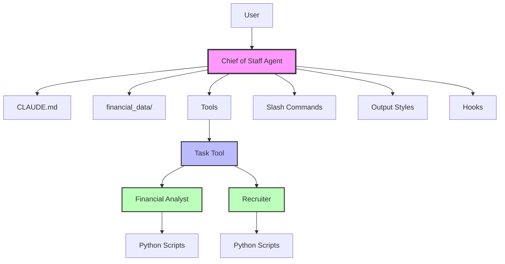
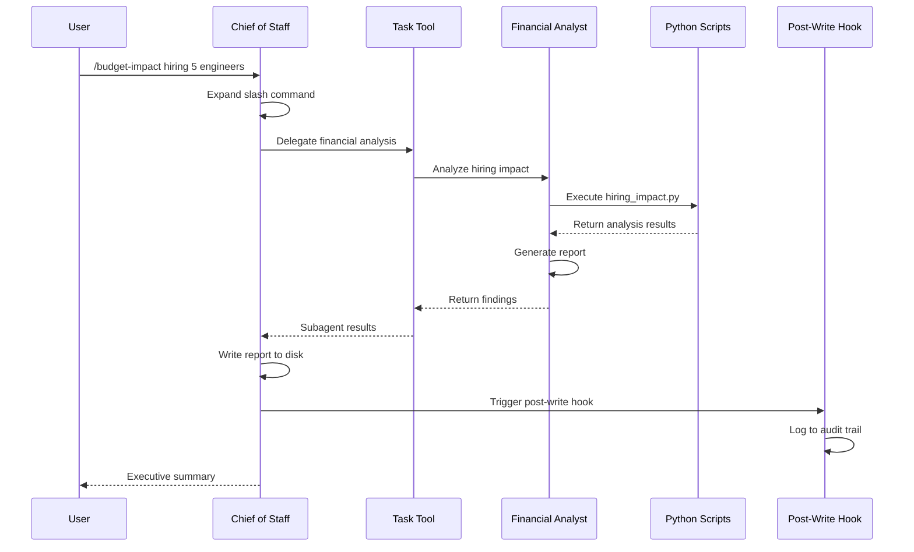

# Chief of Staff Agent Architecture

```mermaid
graph TD
    User[User] --> Chief[Chief of Staff Agent]
    Chief --> Memory[CLAUDE.md]
    Chief --> FinData[financial_data/]
    Chief --> Tools
    Chief --> Commands[Slash Commands]
    Chief --> Styles[Output Styles]
    Chief --> Hooks[Hooks]

    Tools --> Task[Task Tool]
    Task --> FA[Financial Analyst]
    Task --> Recruiter[Recruiter]

    FA --> Scripts1[Python Scripts]
    Recruiter --> Scripts2[Python Scripts]

    style Chief fill:#f9f,stroke:#333,stroke-width:3px
    style Task fill:#bbf,stroke:#333,stroke-width:2px
    style FA fill:#bfb,stroke:#333,stroke-width:2px
    style Recruiter fill:#bfb,stroke:#333,stroke-width:2px
```

## Expected Agent Communication Flow

```mermaid
sequenceDiagram
    participant User
    participant Chief as Chief of Staff
    participant Task as Task Tool
    participant FA as Financial Analyst
    participant Scripts as Python Scripts
    participant Hooks as Post-Write Hook
    User->>Chief: /budget-impact hiring 5 engineers
    Chief->>Chief: Expand slash command
    Chief->>Task: Delegate financial analysis
    Task->>FA: Analyze hiring impact
    FA->>Scripts: Execute hiring_impact.py
    Scripts-->>FA: Return analysis results
    FA->>FA: Generate report
    FA-->>Task: Return findings
    Task-->>Chief: Subagent results
    Chief->>Chief: Write report to disk
    Chief->>Hooks: Trigger post-write hook
    Hooks->>Hooks: Log to audit trail
    Chief-->>User: Executive summary
```
