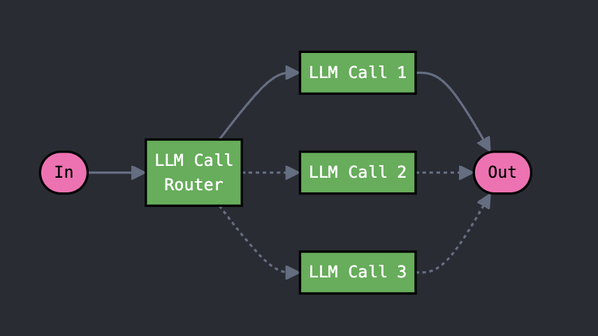
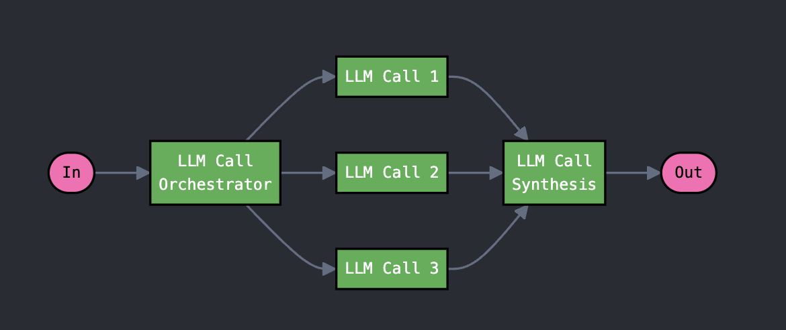
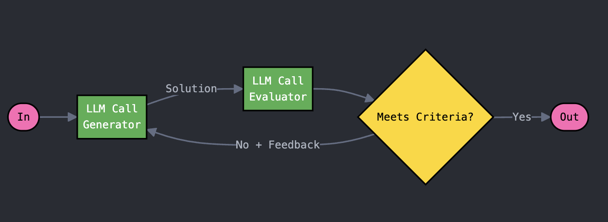

# Building Effective LLM Agents: Field Notes and Patterns

Over the past year, we've worked with dozens of teams building LLM agents across industries, from customer service automation to code generation systems. A pattern emerged consistently: the most successful implementations weren't using complex frameworks or specialized libraries. Instead, they were building with simple, composable patterns.

From our experience building agents and analyzing customer implementations across different scales and domains, we've found that effective architectures often reduce to three fundamental components:

1. LLM for core reasoning
2. Context systems (tools, retrieval, memory) for enrichment
3. Basic control flow for orchestration

Based on these components, we are sharing some patterns not as prescriptive solutions, but as field notes from what we've seen work well.

# Core Patterns in Agent Architecture

## Augmented LLM

The foundation of our patterns is the "Augmented LLM" - a language model enhanced with context systems (retrieval, tools, memory). The LLM can interact with these system passively (e.g. through pre-defined retrieval) or actively (e.g. through tool-calling.) 
For the rest of these patterns, "LLM Call" will refer to Augmented LLMs.
As models advance, we expect this pattern to handle increasingly complex tasks that currently require more sophisticated architectures.

[todo] Add in customer support agent example

## Sequential Multi-LLM

This pattern decomposes a task into a sequence of steps, where each LLM processes the output of the previous one.
 This is also known as prompt-chaining or directed acyclic graphs (DAGs). 
 
 **When to use this pattern**: A single augmented LLM with optimized prompt and context still struggles with the context, and the task can be easily decomposed into subtasks. The main goal here is to trade off cost/latency for higher 
 accuracy by making each LLM call an easier task

 **Example**: Breaking down coding tasks into design, implementation, and verification phases.

## Parallelized Multi-LLM

LLMs can also work simultaneously on a task and have their outputs aggregated programmatically. 
This manifests in two key variations:

* **Sectioning**: Breaking a task into independent subtasks run in parallel
* **Majority-Voting/Self-consistency**: Running the same task multiple times to get diverse outputs or understand the effects non-determinism

**When to use tihs pattern**:
The pattern is effective when tasks can be parallelized for speed, or when multiple perspectives/attempts are needed for higher confidence results.

**Example**:
* **Sectioning**: Long-document analysis where each segment can be analyzed independently
* **Majority-Voting/Self-consistency**: LLM-based evaluation where we want to have diverse feedback

## Routing

A central LLM can act as an orchestrator by directing tasks to specialized LLMs or prompts. 

**When to use tihs pattern**:
This pattern works well for complex tasks where the action space is large and we can enumerate the types of operations needed

**Example**
Routing different types of customer service queries based on intent to corresponding tools, prompts, and operational paths

## Orchestrator-Worker

A central LLM can also dynamically break down tasks, delegate them to worker LLMs, and synthesize their results. 

**When to use tihs pattern**:
The key difference from Routing is its flexibility - subtasks aren't pre-defined but are determined by the controller based on the specific input. 
This pattern is well-suited for complex tasks requiring dynamic decomposition

**Example**
Coding agent that needs to make changes across multiple files 

## Evaluator-Optimizer

In this pattern, one LLM call generates a response while another provides evaluation and feedback in a loop. 

**When to use tihs pattern**:
This pattern is particularly effective when we have clear evaluation criteria and iterative refinement provides measurable value. A sign of good fit for this 
pattern is when humans can articulate their feedback and the LLM responses can clearly improve.

**Example**
Literary translation where there are nuances and fine adjustments that the translator LLM might not capture initially but can make adjustments accordingly

## Autonomous Loop

The most sophisticated of our patterns is when LLMs operate independently in an environment. This could be games, coding environments, computers, and many others.

**When to use tihs pattern**:
This pattern differs from the others in that the LLM trajectory is often long, ambiguous, and loosely defined. There is often a decision required at each step and we can trust
the LLM to make the decision.

**Example**
There are fewer canonical examples but here are some of our works:
* SWE-bench Agent: https://www.anthropic.com/research/swe-bench-sonnet
* Comuter Use: https://github.com/anthropics/anthropic-quickstarts/blob/main/computer-use-demo/computer_use_demo/loop.py
